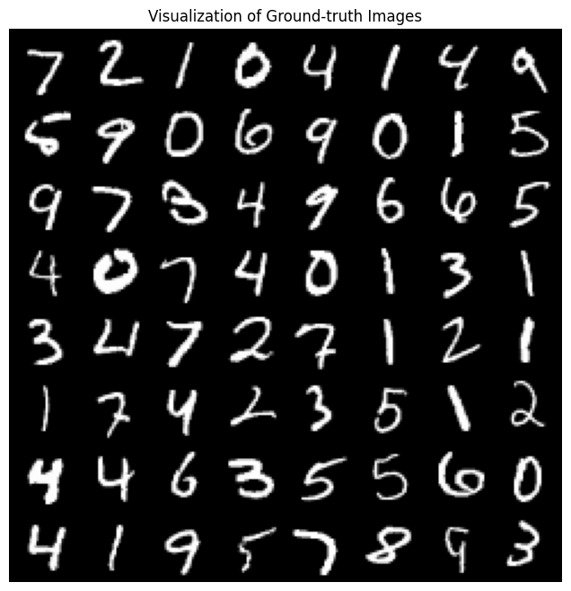
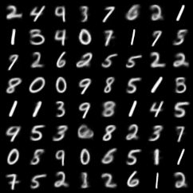
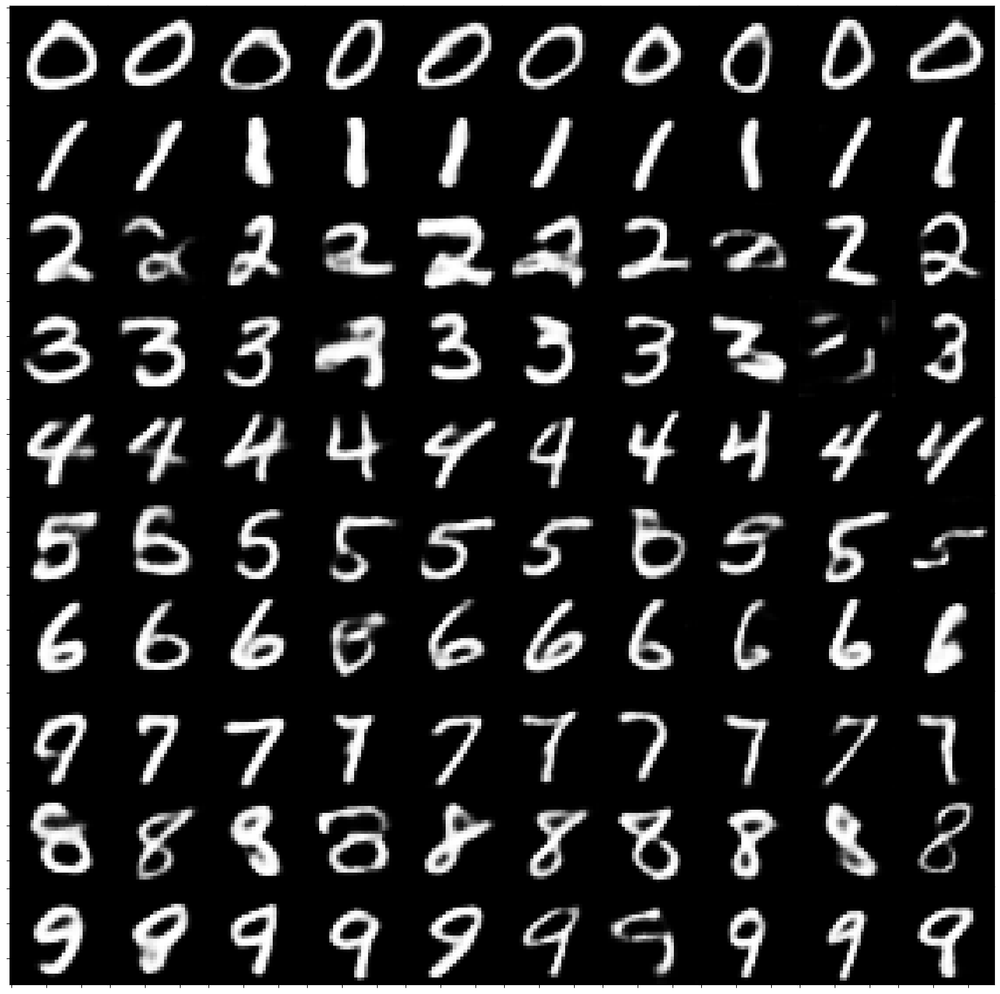
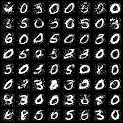
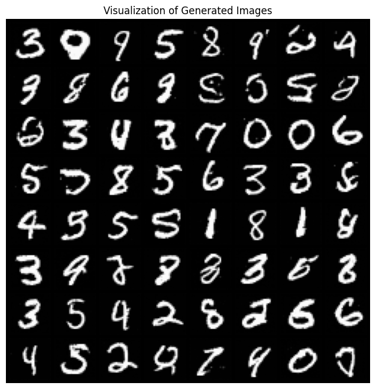

# Generative Model for MNIST Data

## 📌 Overview

This project implements **four different generative models** to generate handwritten digit images based on the **MNIST dataset**. The models include:

- **Variational Autoencoder (VAE)**
- **Normalizing Flow (NF)**
- **Generative Adversarial Network (GAN)**
- **Diffusion Model**

The generated images are evaluated using the **Fréchet Inception Distance (FID Score)** to measure quality and diversity.

---

## 🏗️ Model Architectures

<figure>
  
  <figcaption>Source: <a href="https://lilianweng.github.io/posts/2021-07-11-diffusion-models/">What are Diffusion Models?</a></figcaption>
</figure>

### 1️⃣ Variational Autoencoder (VAE)

VAE learns a probabilistic latent space where each digit is represented as a Gaussian distribution.

### 2️⃣ Normalizing Flow (NF)

NF extends VAE by using a sequence of invertible transformations to model more complex data distributions.

### 3️⃣ Generative Adversarial Network (GAN)

GAN consists of a **Generator** and a **Discriminator**, trained in a minimax game to generate realistic MNIST digits.

### 4️⃣ Diffusion Model

Diffusion models generate images by learning a denoising process that gradually refines random noise into structured images.

---

## 📊 Dataset

**Dataset Source:** [MNIST Handwritten Digits](http://yann.lecun.com/exdb/mnist/)  

---

## 🖼️ Results

### 1️⃣ Variational Autoencoder (VAE)

### 2️⃣ Normalizing Flow (NF)

### 3️⃣ Generative Adversarial Network (GAN)

### 4️⃣ Diffusion Model

---

## 🎯 Evaluation

The **FID Score** is used to compare the generated images with the real MNIST dataset. Lower scores indicate higher image quality and better diversity.

| Model     | FID Score |   Device   | #Epochs | Training Time (second/epoch) |
| --------- | :-------: | :--------: | :-----: | :--------------------------: |
| VAE       |  138.50   |  Tesla T4  |   200   |              11              |
| NF        |   29.92   |   1650Ti   |   20    |              20              |
| GAN       |  243.88   |  Tesla T4  |   200   |              14              |
| Diffusion |   37.53   | Tesla P100 |   200   |             180              |

All models' checkpoints are available [here](https://drive.google.com/drive/folders/1qzyQO_G9T4agOvHymqdZmxtQ7xa3KMhh?usp=sharing).
